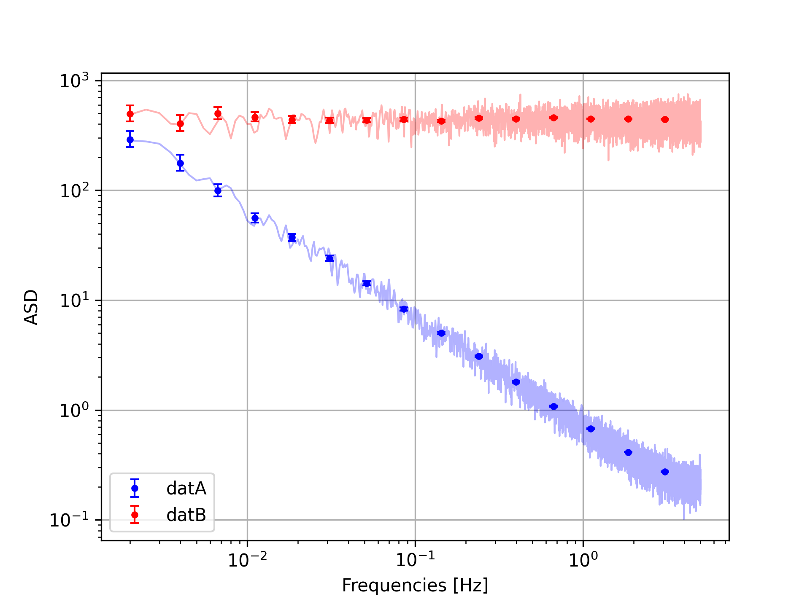
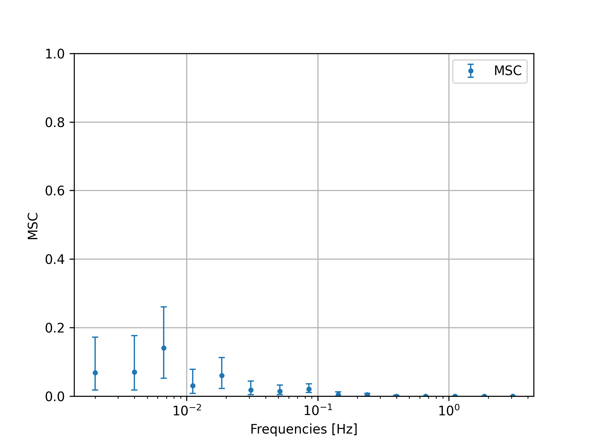
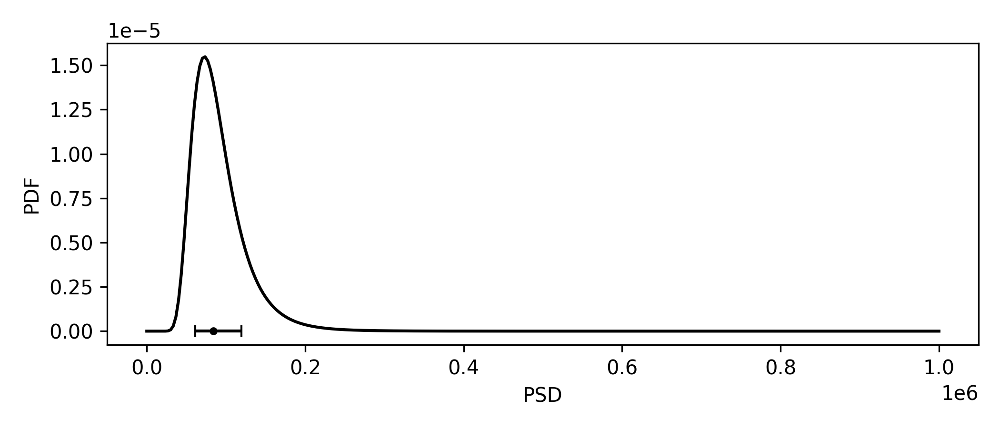
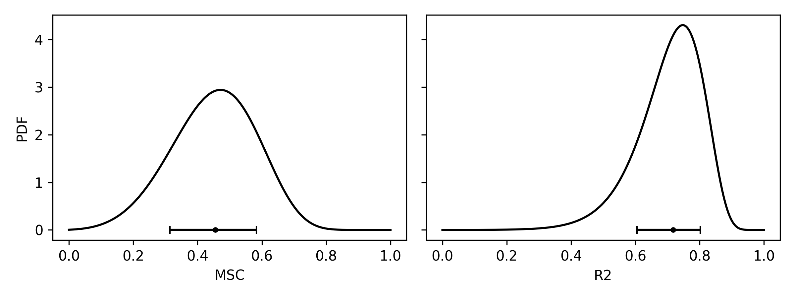

How to use (CPSD estimate)
===========================

Define a Frequency scheme
------------------------------

CPSD calculation (along with PSD estimation, MSC estimation, and confidence interval inference) relies on a *frequency scheme*, i.e., a set of **stretch lengths** and **DFT indexes** at which to calculate the CPSD. Given the two arrays and the sampling frequency, the frequency set is defined by 

.. math:: 
    f = k / (L / f_s)

An example of a frequency scheme is the *WOSA (Welch)*. It has a single stretch length used to calculate the DFT at all indexes :math:`k`. 
Another example, which we provide in :func:`noisefinder.freqscheme_presets.lpfScheme`, is the LPF frequency scheme, with stretch length decreasing logarithmically, and DFT index :math:`k=8` for all frequencies except the first (:math:`k=4`).

.. note::
    Currently, two presets are available in :mod:`noisefinder.freqscheme_presets`:

    #. The LISA Pathfinder scheme :func:`~noisefinder.freqscheme_presets.lpfScheme`,
    #. The WOSA scheme :func:`~noisefinder.freqscheme_presets.wosaScheme`,

    **DFT and FFT.** Generally, every scheme evaluates the CPSD calculating the DFT coefficients at each frequency, which is efficient if the stretch length depends on frequency. In the WOSA case, where the stretch length is the same for all frequencies, we use the FFT.

.. tip::
    The experienced user can create a custom frequency scheme, see also :ref:`custom_frequency_scheme`.

Calculate the CPSD matrix
------------------------------

After defining the frequency scheme, the user can evaluate the CPSD matrix. This is done with the function :func:`noisefinder.cpsd.cpsdevaluate.CPSDevaluate`. Parameters of this function are :attr:`~noisefinder.cpsd.cpsdevaluate.CPSDevaluate.ts` and :attr:`~noisefinder.cpsd.cpsdevaluate.CPSDevaluate.freqscheme`, respectively the list of synchronous timeseries, and the frequency scheme object.
*Note:* the function requires a list of timeseries, even if only one timeseries is present.
This function calculates the CPSD matrix, the PSDs, the MSCs, and the multiple coherence R2.

.. note::
   The boolean parameter :attr:`~noisefinder.cpsd.cpsdevaluate.CPSDevaluate.optimalolap` reduces the maximum overlap :attr:`~noisefinder.cpsd.cpsdevaluate.CPSDevaluate.olapmax` to maximize data usage, for each segment length. See image:

   .. figure:: _images/optimaloverlap.png
       :width: 700px
       :align: center

Extract Statistics
------------------------------
Many function to extract useful statistics (PSD posteriors, confidence intervals, etc.) are available in module :mod:`noisefinder.cpsd.stats`.

Practical Example
------------------------------

For this example, we implement the LPF method, and a give an
introductory example.

.. code:: ipython3

    import noisefinder
    import numpy as np
    import scipy

Just generate two time series with :math:`1/f^2` and white noise
spectrum, for this example.
Calculate the Welch PSD for comparison.

.. code:: ipython3

    datA = np.cumsum(scipy.stats.norm.rvs(size=100000))
    datB = 1000*scipy.stats.norm.rvs(size=100000)
    fs = 10 #sampling frequency

    
Now create a frequency scheme with :func:`noisefinder.freqscheme_presets.lpfScheme`. 
It implements the LPF frequency scheme. Then run evaluation.

.. code:: ipython3

    LPF_frscheme = noisefinder.freqscheme_presets.lpfScheme(
        Lmax=20000, fmax=None, fs=fs
        )
    CPSD_LPF  = noisefinder.cpsd.CPSDevaluate(
        ts=[datA,datB],
        freqscheme=LPF_frscheme
        )

    #calculate Welch for comparison

    WOSA_frscheme = noisefinder.freqscheme_presets.wosaScheme(
        nperseg=20000, win=noisefinder.specwindows.BH92, fs=fs,
        )
    CPSD_WOSA  = noisefinder.cpsd.CPSDevaluate(
        ts=[datA,datB],
        freqscheme=WOSA_frscheme
        )
    PSD_WOSA_datA = CPSD_WOSA.PSD[0]
    PSD_WOSA_datB = CPSD_WOSA.PSD[1]

    # note, this is equivalent to the following with scipy.signal.welch and scipy.signal.csd, if optimalolap=False.
    # in our case, with optimalolap=True, we reduce overlap to maximize data usage
    # PSDfA,PSDvA = scipy.signal.welch(datA,fs=10,window='blackmanharris',nperseg=20000)

It saves useful parameters as attributes (see full list at
:class:`noisefinder.cpsd.cpsdresults.CPSDresults`):

.. code:: ipython3

    CPSD_LPF.CPSD  # The CPSD matrix, at the Fourier frequencies
    CPSD_LPF.PSD   # The PSDs of the input time series, at the Fourier frequencies
    CPSD_LPF.freqs # The Fourier frequencies
    CPSD_LPF.navs  # The number of averaged periodograms, useful for confidence interval evaluation
    CPSD_LPF.cohere # Coherencies
    CPSD_LPF.Ls # The stretch length (number of samples) for CPSD evaluation at each frequency.

Calculate the ASD posterior confidence interval (for instance, at 0.68 -
1 sigma confidence level).

.. code:: ipython3

    ASD_LPF_CI_datA = noisefinder.cpsd.stats.ASDposterior_qnt(
        CPSD_LPF,
        tsidx=0,
        q=[(1-0.68)/2,0.50,((1+0.68)/2)]
        )
    ASD_LPF_CI_datB = noisefinder.cpsd.stats.ASDposterior_qnt(
        CPSD_LPF,
        tsidx=1,
        q=[(1-0.68)/2,0.50,((1+0.68)/2)]
        )

    fig,ax=plt.subplots()
    ax.loglog(CPSD_WOSA.freqs[4:],np.sqrt(PSD_WOSA_datA[4:]),lw=1, c='b', alpha=0.3)
    ax.loglog(CPSD_WOSA.freqs[4:],np.sqrt(PSD_WOSA_datB[4:]),lw=1, c='r', alpha=0.3)

    ax.errorbar(CPSD_LPF.freqs,
                ASD_LPF_CI_datA[1,:],
                yerr = [ASD_LPF_CI_datA[1,:]-ASD_LPF_CI_datA[0,:],
                        ASD_LPF_CI_datA[2,:]-ASD_LPF_CI_datA[1,:]],
                linestyle='',capsize=2.5,lw=1,c='b',fmt='.',label='datA')
    ax.errorbar(CPSD_LPF.freqs,
                ASD_LPF_CI_datB[1,:],
                yerr = [ASD_LPF_CI_datB[1,:]-ASD_LPF_CI_datB[0,:],
                        ASD_LPF_CI_datB[2,:]-ASD_LPF_CI_datB[1,:]],
                linestyle='',capsize=2.5,lw=1,c='r',fmt='.',label='datB')
    ax.grid(); ax.set_xlabel('Frequencies [Hz]'); ax.set_ylabel('ASD'); ax.legend()
    plt.show()

We can also calculate the MSC between the two series, whose true values
in our example is zero.

.. code:: ipython3

    CPSD_LPF_MSC = noisefinder.cpsd.stats.MSCposterior_qnt(CPSD_LPF,idx1=0,idx2=1,q=[(1-0.68)/2,0.50,((1+0.68)/2)])

    fig,ax=plt.subplots()
    ax.errorbar(x=CPSD_LPF.freqs,
                y=CPSD_LPF_MSC[:,1],
                yerr = [CPSD_LPF_MSC[:,1]-CPSD_LPF_MSC[:,0],CPSD_LPF_MSC[:,2]-CPSD_LPF_MSC[:,1]],
                linestyle='',capsize=2.5,lw=1,c='C0',fmt='.',label='MSC')
    ax.grid(); ax.set_ylim([0,1]); ax.set_xscale('log'); ax.legend()
    ax.set_xlabel('Frequencies [Hz]'); ax.set_ylabel('MSC');
    plt.show()

Only calculate CPSD statistics
---------------------------------

| The user could also be interested in calculating PSD statistics (or
  MSC) of a single measured PSD sample, without using the
  functionalities in :mod:`noisefinder.cpsd.stats`.
| This can be done:

.. code:: ipython3

    # PSD posterior distribution, as frozen scipy.stats, of the PSD posterior 
    PSD_datA_distrib = noisefinder.cpsd.stats_methods.PSDposterior_dist_onebin(CPSD_LPF.PSD[0][0], navs=CPSD_LPF.navs[0]) 
    PSD_datA_f0_rvs = PSD_datA_distrib.rvs(size=100000)

    # PSD pdf, evaluated at given points
    PSDth_axis = np.linspace(0,1e6,300)
    PSDpdf = noisefinder.cpsd.stats_methods.PSDposterior_onebin(CPSD_LPF.PSD[0][0], navs=CPSD_LPF.navs[0],PSDth=PSDth_axis)
    PSDCI  = noisefinder.cpsd.stats.PSDposterior_qnt(CPSD_LPF, tsidx=0, q=[(1-0.68)/2,0.50,((1+0.68)/2)])

    MSCth=np.linspace(0,1,300)
    MSCexp=0.5; navs=14;
    MSCpdf = noisefinder.cpsd.stats_methods.MSCposterior_onebin(MSCth=MSCth,MSCexp=MSCexp,navs=navs) # MSC posterior evaluated on the MSCth axis 
    MSCCI = noisefinder.cpsd.stats_methods.MSCposterior_qnt_onebin(MSCexp=MSCexp,navs=navs,q=[(1-0.68)/2,0.50,((1+0.68)/2)]) # MSC posterior confidence interval at given confidence level

    R2th=np.linspace(0,1,300)
    R2exp=0.8
    R2pdf = noisefinder.cpsd.stats_methods.R2posterior_onebin(R2th=R2th,R2exp=R2exp,navs=navs,p=4) # R2 posterior, evaluated on the R2th axis. p is the number of timeseries
    R2CI = noisefinder.cpsd.stats_methods.R2posterior_qnt_onebin(R2exp=R2exp,navs=navs,p=4,q=[(1-0.68)/2,0.50,((1+0.68)/2)]) # R2 posterior confidence interval at given confidence level

.. _custom_frequency_scheme:

Experienced user: custom frequency scheme
------------------------------------------

| The experienced user can define new frequency schemes, creating instances of :class:`noisefinder.freqscheme.FreqScheme`.
| A simple example, with just three hardcoded frequencies, is

.. code:: ipython3

    def custom_freqscheme(fs): # more user-defined params
        BH92 = noisefinder.specwindows.BH92 #user-defined
        Ls = np.array([20000, 12000, 7200]) #user-defined, with external method
        dft_idxs = np.array([8,8,8]) #user-defined, with external method
        return noisefinder.FreqScheme(
            fs=fs,
            olapmax=0.50,
            dft_idxs=dft_idxs,
            Ls=Ls,
            win=BH92,
            optimalolap=True,
            name="custom name"
        )