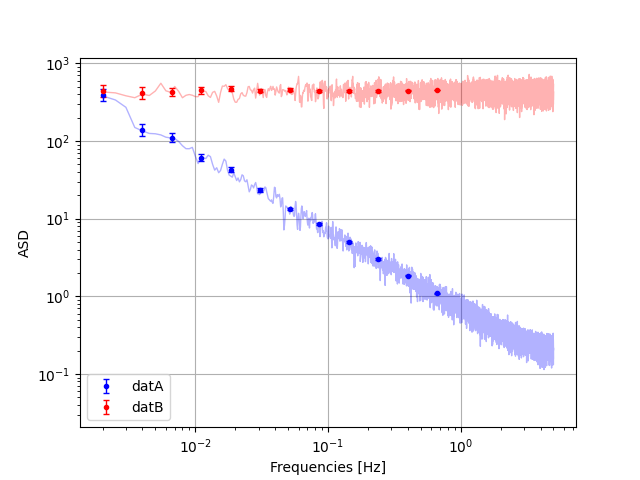
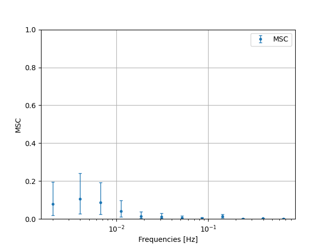
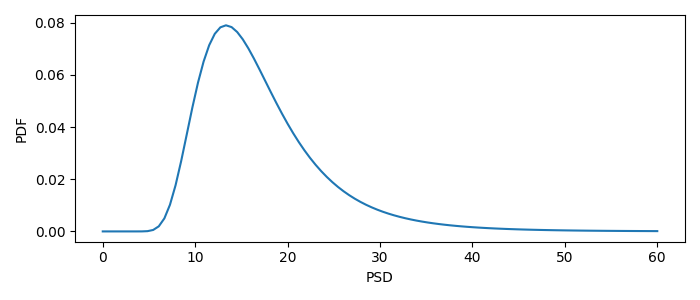
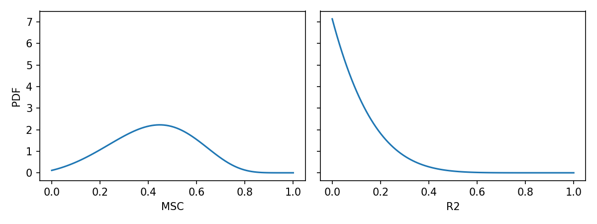

How to use
==========

Installation
------------

Install using `pip`

::

   pip install gitblabla

Calculate CPSDs and statistics
------------------------------

| Generally, calculate the CPSD matrix of a few time series
  (synchronously sampled) with the class
  :class:`noisefinder.CPSDstats`.
| Note that :class:`noisefinder.CPSDstats` does not include a
  *frequency scheme*, i.e., a set of frequencies, stretch length, and
  Fourier index at which to calculate the CPSDs.
| The experienced user can create their own classes, which inherit from
  :class:`noisefinder.CPSDstats` and use it for CPSD evaluation and
  statistics.
| In `noisefinder`, we provide useful frequency schemes: - The *LPF
  frequency scheme*, :class:`noisefinder.CPSD_LPFmethod`, with
  logarithmic-spaced frequencies and stretch lengths, and constant
  Fourier index (see :class:`noisefinder.CPSD_LPFmethod` for details).
  - The *WOSA (Welch) frequency scheme*,
  :class:`noisefinder.CPSD_WOSAmethod`, with linearly-spaced
  frequencies, and a single stretch length.

For this example, we implement the LPF method, and a give an
introductory example.

.. code:: ipython3

    import noisefinder
    import numpy as np
    import scipy.stats as st
    import scipy.signal as sig

| Just generate two time series with :math:`1/f^2` and white noise
  spectrum, for this example.
| Calculate the Welch PSD for comparison.

.. code:: ipython3

    datA = np.cumsum(st.norm.rvs(size=100000))
    datB = 1000*st.norm.rvs(size=100000)
    fs = 10 #sampling frequency
    
    #calculate welch for comparison
    PSDfA,PSDvA = sig.welch(datA,fs=10,window='blackmanharris',nperseg=20000)
    PSDfB,PSDvB = sig.welch(datB,fs=10,window='blackmanharris',nperseg=20000)

Now create a :class:`noisefinder.CPSD_LPFmethod` instance. It already
implements the LPF frequency scheme and calculates the CPSD matrices at
those frequencies.

.. code:: ipython3

    meas_LPFmethod = noisefinder.CPSD_LPFmethod(ts=[datA,datB],fs=fs,Tmax=2000,fmax=1)

It saves useful parameters as class attributes (see full list at
:class:`noisefinder.CPSDstats`):

.. code:: ipython3

    meas_LPFmethod.CPSD  # The CPSD matrix, at the Fourier frequencies
    meas_LPFmethod.PSD   # The PSDs of the input time series, at the Fourier frequencies
    meas_LPFmethod.freqs # The Fourier frequencies
    meas_LPFmethod.navs  # The number of averaged periodograms, useful for confidence interval evaluation
    meas_LPFmethod.cohere # Coherencies
    meas_LPFmethod.Ls # The stretch length (number of samples) for CPSD evaluation at each frequency.

Calculate the PSD posterior confidence interval (for instance, at 0.68 -
1 sigma confidence level).

.. code:: ipython3

    #extract quantiles
    meas_LPFmethod_PSDq = meas_LPFmethod.PSDquantiles_eval(cval=0.68)
    meas_LPFmethod_PSDq_datA = meas_LPFmethod_PSDq[0,:,:]
    meas_LPFmethod_PSDq_datB = meas_LPFmethod_PSDq[1,:,:]
    
    fig,ax=plt.subplots()
    ax.loglog(PSDfA[4:],np.sqrt(PSDvA[4:]),lw=1, c='b', alpha=0.3)
    ax.loglog(PSDfB[4:],np.sqrt(PSDvB[4:]),lw=1, c='r', alpha=0.3)
    
    ax.errorbar(meas_LPFmethod.freqs,
                np.sqrt(meas_LPFmethod_PSDq_datA[1,:]),
                yerr = [np.sqrt(meas_LPFmethod_PSDq_datA[1,:])-np.sqrt(meas_LPFmethod_PSDq_datA[0,:]),
                        np.sqrt(meas_LPFmethod_PSDq_datA[2,:])-np.sqrt(meas_LPFmethod_PSDq_datA[1,:])],
                linestyle='',capsize=2.5,lw=1,c='b',fmt='.',label='datA')
    ax.errorbar(meas_LPFmethod.freqs,
                np.sqrt(meas_LPFmethod_PSDq_datB[1,:]),
                yerr = [np.sqrt(meas_LPFmethod_PSDq_datB[1,:])-np.sqrt(meas_LPFmethod_PSDq_datB[0,:]),
                        np.sqrt(meas_LPFmethod_PSDq_datB[2,:])-np.sqrt(meas_LPFmethod_PSDq_datB[1,:])],
                linestyle='',capsize=2.5,lw=1,c='r',fmt='.',label='datB')
    ax.grid(); ax.set_xlabel('Frequencies [Hz]'); ax.set_ylabel('ASD'); ax.legend()
    plt.show()

We can also calculate the MSC between the two series, whose true values
in our example is zero.

.. code:: ipython3
    
    meas_LPFmethod_MSCq_AB = meas_LPFmethod.MSCquantiles_eval(idx1=0,idx2=1,cval=0.68)
    
    fig,ax=plt.subplots()
    ax.errorbar(x=meas_LPFmethod.freqs,
                y=meas_LPFmethod_MSCq_AB[:,1],
                yerr = [meas_LPFmethod_MSCq_AB[:,1]-meas_LPFmethod_MSCq_AB[:,0],meas_LPFmethod_MSCq_AB[:,2]-meas_LPFmethod_MSCq_AB[:,1]],
                linestyle='',capsize=2.5,lw=1,c='C0',fmt='.',label='MSC')
    ax.grid(); ax.set_ylim([0,1]); ax.set_xscale('log'); ax.legend()
    ax.set_xlabel('Frequencies [Hz]'); ax.set_ylabel('MSC');
    plt.show()

Note that all the functionalities above, and more, can be used with different frequency schemes such as :class:`noisefinder.CPSD_WOSAmethod`, or a custom-defined one.

Only calculate CPSD statistics
---------------------------------

| The user could also be interested in calculating PSD statistics (or
  MSC) of a single measured PSD sample, without using the
  functionalities of :class:`noisefinder.CPSD_LPFmethod`.
| This can be done:

.. code:: ipython3

    from noisefinder.CPSDstats import CPSDstats_methods as cpm
    
    PSDpp = cpm.PSDposterior(expPSD=15.0,navs=8)     # PSD posterior, as frozen scipy.stats, of the PSD posterior 
    PSDCI = cpm.PSDpostCI(expPSD=15.0,navs=8,c=0.68) # PSD posterior confidence interval at given confidence level
    
    rho2th=np.linspace(0,1,100)
    rho2pp = cpm.rho2posterior(rho2th=rho2th,rho2exp=0.5,navs=8) # MSC posterior evaluated on the rho2th axis 
    rho2CI = cpm.rho2postCI(r2e=0.5,navs=8,c=0.68) # MSC posterior confidence interval at given confidence level
    
    R2th=np.linspace(0,1,100)
    R2pp = cpm.R2posterior(R2th=R2th,R2exp=0.1,navs=8,p=4) # R2 posterior, evaluated on the R2th axis. p is the number of timeseries
    R2CI = cpm.R2postCI(R2e=0.1,navs=8,p=4,c=0.68) # R2 posterior confidence interval at given confidence level
    
    PSDaxis = np.linspace(0,60,100)
    fig,ax=plt.subplots(figsize=(6,3))
    ax.plot(PSDaxis,PSDpp.pdf(PSDaxis))
    ax.set_xlabel('PSD'); ax.set_ylabel('PDF')
    
    fig,ax=plt.subplots(1,2,figsize=(9,4),sharey=True,sharex=True)
    ax[0].plot(rho2th,rho2pp)
    ax[0].set_xlabel('MSC'); ax[0].set_ylabel('PDF')
    
    ax[1].plot(R2th,R2pp)
    ax[1].set_xlabel('R2'); ax[1].set_ylabel('PDF')

Experienced user: custom frequency scheme
------------------------------------------

| The experienced user can define new frequency schemes, as new classes inheriting from :class:`noisefinder.CPSDstats`.
| A simple example, with just three hardcoded frequencies, is

.. code:: ipython3

    class CPSD_custom(noisefinder.CPSDstats):
        def __init__(self,ts,fs,detrend_c=False,verbose=False): # more user-defined params
            win = noisefinder.specwindows.BH92 #user-defined
            olap = 50 #user-defined 
            super().__init__(ts=ts,fs=fs,win=win,olap=olap,detrend_c=detrend_c)
            freqs = np.array([0.004, 0.0066667, 0.0111111]) #user-defined, with external method
            Ls = np.array([20000, 12000, 7200]) #user-defined, with external method
            kcoeffs = np.array([8,8,8]) #user-defined, with external method
            self.CPSD_eval(freqs,Ls,kcoeffs) #explicitly evaluate CPSD matrices

    meas_custom = CPSD_custom(ts=[datA,datB],fs=fs)