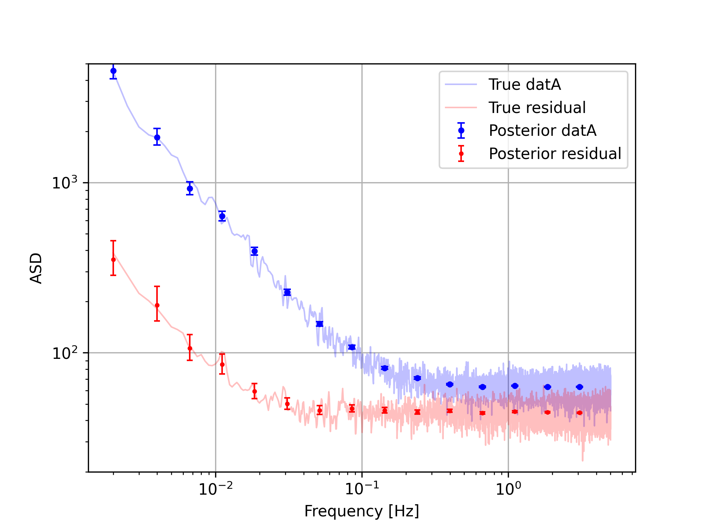
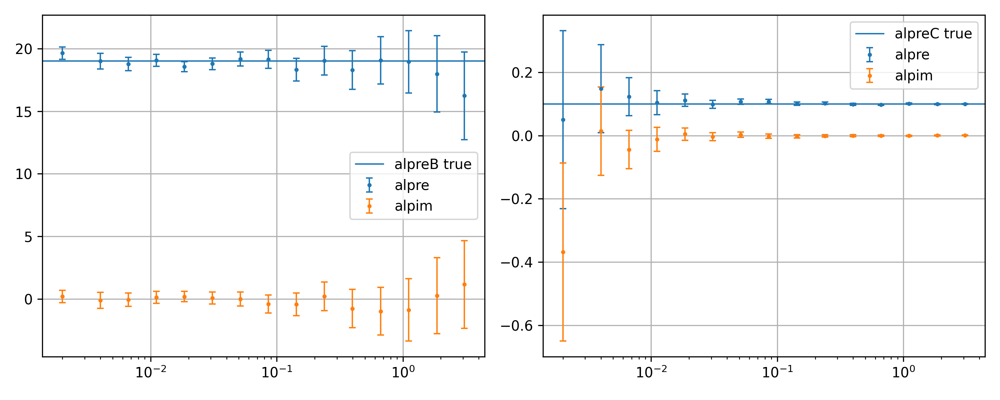

How to use (Decorrelation)
===============================

General usage
-------------

:mod:`noisefinder` can also perform *noise projection*, or
*decorrelation*, as we describe in the reference paper. Let’s work out a
minimal example.

.. code:: ipython3

    import noisefinder
    import numpy as np
    import scipy

| Generate three time series with known PSDs. The measured ones are
  included in the vector `meas`, whereas `datres` is the residual,
  whose PSD we want to retrieve as a result.
| The main timeseries :math:`A` is correlated to :math:`B` and
  :math:`C` through the coefficients :math:`\alpha_i=19,0.1`, which
  we also want to retrieve.

.. code:: ipython3

    datres = np.cumsum(st.norm.rvs(size=210000))+100*st.norm.rvs(size=210000)
    datB = 0.5*np.cumsum(st.norm.rvs(size=210000))
    datC = 1000*st.norm.rvs(size=210000)
    
    alphaB = 19
    alphaC = 0.10
    datA = datres + alphaB*datB + alphaC*datC
    
    datres_true = lambda f: np.sqrt((1*10*np.sqrt(2/10)/(2*np.pi*f))**2 + (100*np.sqrt(2/10)*f**0)**2)
    datB_true = lambda f: 0.5*10*np.sqrt(2/10)/(2*np.pi*f)
    datC_true = lambda f: 1000*np.sqrt(2/10)*f**0
    datA_true = lambda f: np.sqrt((datres_true(f))**2 + (19*datB_true(f))**2 + (0.10*datC_true(f))**2)
    meas = [datA,datB,datC]
    
    #calculate welch for comparison
    PSDfres,PSDvres = sig.welch(datres,fs=10,window='blackmanharris',nperseg=20000)
    PSDfA,PSDvA = sig.welch(datA,fs=10,window='blackmanharris',nperseg=20000)
    PSDfB,PSDvB = sig.welch(datB,fs=10,window='blackmanharris',nperseg=20000)
    PSDfC,PSDvC = sig.welch(datC,fs=10,window='blackmanharris',nperseg=20000)

| We evaluate the PSD and its statistics.

.. code:: ipython3

    fs = 10
    LPF_frscheme = noisefinder.freqscheme_presets.lpfScheme(Lmax=20000, fmax=None, fs=fs)
    CPSD_LPF  = noisefinder.cpsd.CPSDevaluate(ts=[datA,datB,datC],freqscheme=LPF_frscheme)
    ASD_LPF_CI_datA = noisefinder.cpsd.stats.ASDposterior_qnt(CPSD_LPF,tsidx=0,q=[(1-0.68)/2,0.50,((1+0.68)/2)])

Now, we perform noise projection / decorrelation, with
:mod:`noisefinder.noiseproj`, and get the residual confidence
intervals with :func:`noisefinder.noiseproj.stats.PSDresidual_qnt`, :func:`noisefinder.noiseproj.stats.ASDresidual_qnt`, and :func:`noisefinder.noiseproj.stats.alpha_qnt`.

.. code:: ipython3

    # now perform noise projection and retrieve residual
    mfnp = noisefinder.noiseproj.run_noiseproj(CPSDmat=CPSD_LPF.CPSD,navs=CPSD_LPF.navs)

    ASDres_2sigma = noisefinder.noiseproj.stats.ASDresidual_qnt(mfnp,q=[(1-0.95)/2,0.50,((1+0.95)/2)])

    alpre_2sigma, alpim_2sigma = noisefinder.noiseproj.stats.alpha_qnt(mfnp,q=[(1-0.95)/2,0.50,((1+0.95)/2)])

Plot the residual ASD, comparing with the expected values.

.. code:: ipython3

    fig,ax=plt.subplots()
    ax.loglog(PSDfA[4:],np.sqrt(PSDvA[4:]),lw=1,label='True datA',c='b',alpha=0.25)
    ax.loglog(PSDfres[4:],np.sqrt(PSDvres[4:]),lw=1,c='r',label='True residual',alpha=0.25)

    ax.errorbar(CPSD_LPF.freqs,
                ASD_LPF_CI_datA[1,:],
                yerr = [ASD_LPF_CI_datA[1,:]-ASD_LPF_CI_datA[0,:],
                        ASD_LPF_CI_datA[2,:]-ASD_LPF_CI_datA[1,:]],
                linestyle='',capsize=2.5,lw=1,c='b',fmt='.',label='Posterior datA')

    ax.errorbar(CPSD_LPF.freqs,
                ASDres_2sigma[1],
                yerr = [ASDres_2sigma[1]-ASDres_2sigma[0],ASDres_2sigma[2]-ASDres_2sigma[1]],
                linestyle='',capsize=2,lw=1,c='r',fmt='.',markersize=4,label='Posterior residual')

    ax.grid(); ax.legend(); ax.set_ylim(2e1,5e3);
    ax.set_xlabel('Frequency [Hz]'); ax.set_ylabel('ASD'); 
    plt.show()

And plot the susceptibilities, with their expected values.

.. code:: ipython3

    fig,ax=plt.subplots(1,2,figsize=(10,4),sharex=True)

    tsidx = 0
    ax[0].errorbar(CPSD_LPF.freqs,
                alpre_2sigma[:,tsidx,1],
                yerr = [alpre_2sigma[:,tsidx,1]-alpre_2sigma[:,tsidx,0],alpre_2sigma[:,tsidx,2]-alpre_2sigma[:,tsidx,1]],
                linestyle='',capsize=2.5,lw=1,fmt='.',markersize=4,label='alpre')
    ax[0].axhline(19,c='C0',lw=1,label='alpreB true')
    ax[0].errorbar(CPSD_LPF.freqs,
                alpim_2sigma[:,tsidx,1],
                yerr = [alpim_2sigma[:,tsidx,1]-alpim_2sigma[:,tsidx,0],alpim_2sigma[:,tsidx,2]-alpim_2sigma[:,tsidx,1]],
                linestyle='',capsize=2.5,lw=1,fmt='.',markersize=4,label='alpim')
    ax[0].set_xscale('log'); ax[0].grid(); ax[0].legend()

    tsidx = 1
    ax[1].errorbar(CPSD_LPF.freqs,
                alpre_2sigma[:,tsidx,1],
                yerr = [alpre_2sigma[:,tsidx,1]-alpre_2sigma[:,tsidx,0],alpre_2sigma[:,tsidx,2]-alpre_2sigma[:,tsidx,1]],
                linestyle='',capsize=2.5,lw=1,fmt='.',markersize=4,label='alpre')
    ax[1].axhline(0.1,c='C0',lw=1,label='alpreC true')
    ax[1].errorbar(CPSD_LPF.freqs,
                alpim_2sigma[:,tsidx,1],
                yerr = [alpim_2sigma[:,tsidx,1]-alpim_2sigma[:,tsidx,0],alpim_2sigma[:,tsidx,2]-alpim_2sigma[:,tsidx,1]],
                linestyle='',capsize=2.5,lw=1,fmt='.',markersize=4,label='alpim')
    ax[1].set_xscale('log'); ax[1].grid(); ax[1].legend()
    fig.tight_layout()
    plt.show()

