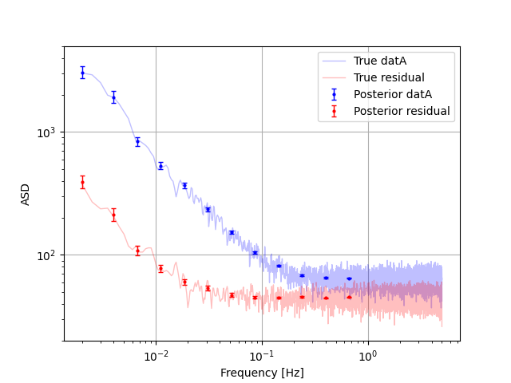
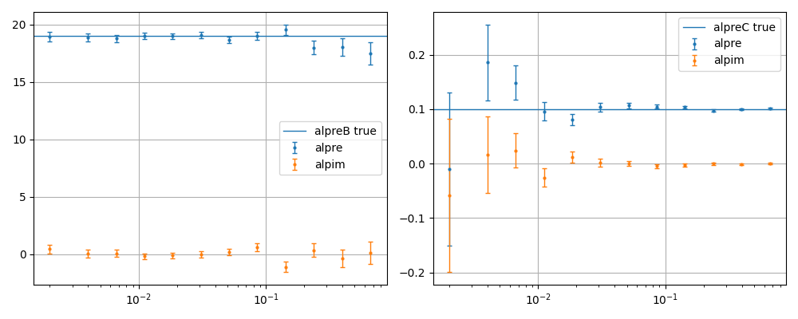

How to use (decorr)
===================

General usage
-------------

:mod:`noisefinder` can also perform *noise projection*, or
*decorrelation*, as we describe in the reference paper. Let’s work out a
minimal example.

.. code:: ipython3

    import noisefinder
    import numpy as np
    import scipy.stats as st
    import scipy.signal as sig

| Generate three time series with known PSDs. The measured ones are
  included in the vectore `meas`, whereas `datares` is the residual,
  unknown to the algorithm, which we would like to retrieve as a result
  (its PSD).
| The main timeseries :math:`A` is correlated to :math:`B` and
  :math:`C` through the coefficients :math:`\alpha_i=19,0.1`, which
  we also want to retrieve.

.. code:: ipython3

    datres = np.cumsum(st.norm.rvs(size=210000))+100*st.norm.rvs(size=210000)
    datB = 0.5*np.cumsum(st.norm.rvs(size=210000))
    datC = 1000*st.norm.rvs(size=210000)
    
    alphaB = 19
    alphaC = 0.10
    datA = datres + alphaB*datB + alphaC*datC
    
    datres_true = lambda f: np.sqrt((1*10*np.sqrt(2/10)/(2*np.pi*f))**2 + (100*np.sqrt(2/10)*f**0)**2)
    datB_true = lambda f: 0.5*10*np.sqrt(2/10)/(2*np.pi*f)
    datC_true = lambda f: 1000*np.sqrt(2/10)*f**0
    datA_true = lambda f: np.sqrt((datres_true(f))**2 + (19*datB_true(f))**2 + (0.10*datC_true(f))**2)
    meas = [datA,datB,datC]
    
    #calculate welch for comparison
    PSDfres,PSDvres = sig.welch(datres,fs=10,window='blackmanharris',nperseg=20000)
    PSDfA,PSDvA = sig.welch(datA,fs=10,window='blackmanharris',nperseg=20000)
    PSDfB,PSDvB = sig.welch(datB,fs=10,window='blackmanharris',nperseg=20000)
    PSDfC,PSDvC = sig.welch(datC,fs=10,window='blackmanharris',nperseg=20000)

| We create an instance of :class:`noisefinder.CPSD_LPFmethod`, as we
  want to do it with the LPF frequency scheme, for this example.
| We evaluate the PSD quantiles, as we will use them later.

.. code:: ipython3

    meas_LPFmethod = noisefinder.CPSD_LPFmethod(ts=[datA,datB,datC],fs=10,Tmax=2000,fmax=1)
    meas_LPFmethod_PSDq = meas_LPFmethod.PSDquantiles_eval(cval=0.68)
    meas_LPFmethod_PSDq_datA = meas_LPFmethod_PSDq[0,:,:]

Now, we perform noise projection / decorrelation, with
:class:`noisefinder.noiseproj`, and get the residual confidence
intervals with :meth:`get_noiseprojCI`.

.. code:: ipython3

    # now decorrelate
    meas_sfnp = noisefinder.noiseproj(meas_LPFmethod)
    meas_PSDq_resid,meas_alpre,meas_alpim = meas_sfnp.get_noiseprojCI(cval=0.68)

Plot the residual ASD, comparing with the expected values.

.. code:: ipython3

    fig,ax=plt.subplots()
    ax.loglog(PSDfA[4:],np.sqrt(PSDvA[4:]),lw=1,label='True datA',c='b',alpha=0.25)
    ax.loglog(PSDfres[4:],np.sqrt(PSDvres[4:]),lw=1,c='r',label='True residual',alpha=0.25)
    
    tsidx = 0
    ax.errorbar(meas_LPFmethod.freqs,
                np.sqrt(meas_LPFmethod_PSDq_datA[1,:]),
                yerr = [np.sqrt(meas_LPFmethod_PSDq_datA[1,:])-np.sqrt(meas_LPFmethod_PSDq_datA[0,:]),
                        np.sqrt(meas_LPFmethod_PSDq_datA[2,:])-np.sqrt(meas_LPFmethod_PSDq_datA[1,:])],
                linestyle='',capsize=2,lw=1,c='b',fmt='.',markersize=4,label='Posterior datA')
    
    ax.errorbar(meas_LPFmethod.freqs,
                np.sqrt(meas_PSDq_resid[:,1]),
                yerr = [np.sqrt(meas_PSDq_resid[:,1])-np.sqrt(meas_PSDq_resid[:,0]),np.sqrt(meas_PSDq_resid[:,2])-np.sqrt(meas_PSDq_resid[:,1])],
                linestyle='',capsize=2,lw=1,c='r',fmt='.',markersize=4,label='Posterior residual')
    
    ax.grid(); ax.legend(); ax.set_ylim(2e1,5e3);
    ax.set_xlabel('Frequency [Hz]'); ax.set_ylabel('ASD'); 
    plt.show()

And plot the susceptibilities, with their expected values.

.. code:: ipython3

    fig,ax=plt.subplots(1,2,figsize=(10,4),sharex=True)
    
    tsidx = 0
    ax[0].errorbar(meas_LPFmethod.freqs,
                meas_alpre[:,tsidx,1],
                yerr = [meas_alpre[:,tsidx,1]-meas_alpre[:,tsidx,0],meas_alpre[:,tsidx,2]-meas_alpre[:,tsidx,1]],
                linestyle='',capsize=2.5,lw=1,fmt='.',markersize=4,label='alpre')
    ax[0].axhline(19,c='C0',lw=1,label='alpreB true')
    ax[0].errorbar(meas_LPFmethod.freqs,
                meas_alpim[:,tsidx,1],
                yerr = [meas_alpim[:,tsidx,1]-meas_alpim[:,tsidx,0],meas_alpim[:,tsidx,2]-meas_alpim[:,tsidx,1]],
                linestyle='',capsize=2.5,lw=1,fmt='.',markersize=4,label='alpim')
    ax[0].set_xscale('log'); ax[0].grid(); ax[0].legend()
    
    tsidx = 1
    ax[1].errorbar(meas_LPFmethod.freqs,
                meas_alpre[:,tsidx,1],
                yerr = [meas_alpre[:,tsidx,1]-meas_alpre[:,tsidx,0],meas_alpre[:,tsidx,2]-meas_alpre[:,tsidx,1]],
                linestyle='',capsize=2.5,lw=1,fmt='.',markersize=4,label='alpre')
    ax[1].axhline(0.1,c='C0',lw=1,label='alpreC true')
    ax[1].errorbar(meas_LPFmethod.freqs,
                meas_alpim[:,tsidx,1],
                yerr = [meas_alpim[:,tsidx,1]-meas_alpim[:,tsidx,0],meas_alpim[:,tsidx,2]-meas_alpim[:,tsidx,1]],
                linestyle='',capsize=2.5,lw=1,fmt='.',markersize=4,label='alpim')
    ax[1].set_xscale('log'); ax[1].grid(); ax[1].legend()
    fig.tight_layout()
    plt.show()

